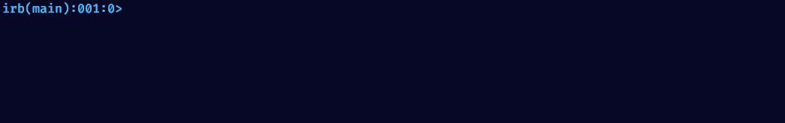

### Hi there, I'm Thiago! 👋

 
 

- 🎓 Graduating in Software Engineering - <a href="https://estacio.br/"> Estácio</a>  
- 📖 I'm currently learning Python and Ruby
- 🔍️ I'm looking to collaborate with Flutter projects
- 📫 How to reach me: thiagop.pinho@outlook.com   

  

